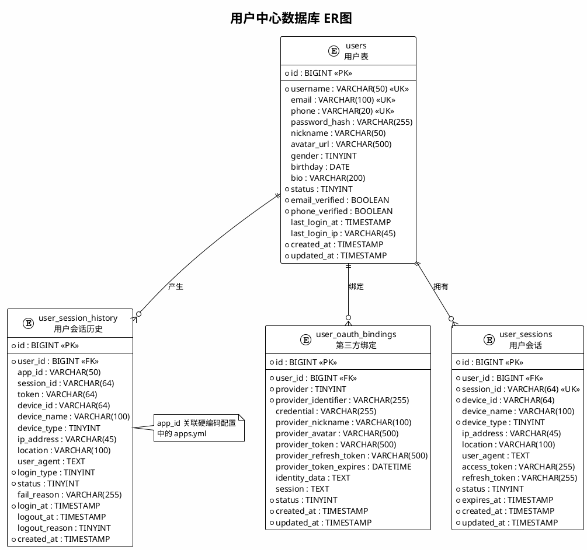

# 用户中心 - 数据库设计

## 1. 概述

本文档描述用户中心模块的数据库表结构，包括用户基础信息、第三方认证绑定、会话管理等。

**数据库**: MySQL 8.0+
**字符集**: utf8mb4
**存储引擎**: InnoDB


## 2. 表结构

### 2.1 用户基础表 (users)

存储用户基本信息。

| 字段名 | 类型 | 是否必填 | 默认值 | 说明 |
|--------|------|---------|--------|------|
| id | BIGINT UNSIGNED | PK | AUTO_INCREMENT | 主键 |
| user_name | VARCHAR(64) | UK | '' | 账号/用户名 |
| nick_name | VARCHAR(64) | NULL | '' | 用户昵称 |
| avatar | VARCHAR(255) | NULL | '' | 头像URL |
| phone | VARCHAR(16) | UK, NULL | NULL | 联系手机 |
| email | VARCHAR(100) | UK, NULL | NULL | 邮箱 |
| password | VARCHAR(255) | NULL | '' | 登录密码(bcrypt加密) |
| gender | TINYINT UNSIGNED | NULL | 0 | 性别: 0未知, 1男, 2女 |
| birthday | DATE | NULL | NULL | 生日 |
| bio | VARCHAR(200) | NULL | '' | 个人简介 |
| status | TINYINT UNSIGNED | NOT NULL | 1 | 状态: 0禁用, 1启用, 2未激活 |
| email_verified | TINYINT UNSIGNED | NOT NULL | 0 | 邮箱是否验证: 0否, 1是 |
| phone_verified | TINYINT UNSIGNED | NOT NULL | 0 | 手机是否验证: 0否, 1是 |
| latest_login_at | DATETIME | NULL | NULL | 最近登录时间 |
| latest_login_ip | VARCHAR(45) | NULL | '' | 最近登录IP |
| created_at | DATETIME | NOT NULL | CURRENT_TIMESTAMP | 创建时间 |
| updated_at | DATETIME | NOT NULL | CURRENT_TIMESTAMP | 更新时间 |

**DDL**：
```sql
CREATE TABLE `users` (
    `id` BIGINT UNSIGNED NOT NULL AUTO_INCREMENT COMMENT '主键ID',
    `user_name` VARCHAR(64) NOT NULL DEFAULT '' COMMENT '账号/用户名',
    `nick_name` VARCHAR(64) NOT NULL DEFAULT '' COMMENT '用户昵称',
    `avatar` VARCHAR(255) NOT NULL DEFAULT '' COMMENT '头像URL',
    `phone` VARCHAR(16) NULL DEFAULT NULL COMMENT '联系手机',
    `email` VARCHAR(100) NULL DEFAULT NULL COMMENT '邮箱',
    `password` VARCHAR(255) NOT NULL DEFAULT '' COMMENT '登录密码(bcrypt加密)',
    `gender` TINYINT UNSIGNED NULL DEFAULT 0 COMMENT '性别: 0未知, 1男, 2女',
    `birthday` DATE NULL DEFAULT NULL COMMENT '生日',
    `bio` VARCHAR(200) NOT NULL DEFAULT '' COMMENT '个人简介',
    `status` TINYINT UNSIGNED NOT NULL DEFAULT 1 COMMENT '状态: 0禁用, 1启用, 2未激活',
    `email_verified` TINYINT UNSIGNED NOT NULL DEFAULT 0 COMMENT '邮箱是否验证: 0否, 1是',
    `phone_verified` TINYINT UNSIGNED NOT NULL DEFAULT 0 COMMENT '手机是否验证: 0否, 1是',
    `latest_login_at` DATETIME NULL DEFAULT NULL COMMENT '最近登录时间',
    `latest_login_ip` VARCHAR(45) NOT NULL DEFAULT '' COMMENT '最近登录IP',
    `created_at` DATETIME NOT NULL DEFAULT CURRENT_TIMESTAMP COMMENT '创建时间',
    `updated_at` DATETIME NOT NULL DEFAULT CURRENT_TIMESTAMP ON UPDATE CURRENT_TIMESTAMP COMMENT '更新时间',
    PRIMARY KEY (`id`) USING BTREE,
    UNIQUE INDEX `unique_index_phone` (`phone`) USING BTREE,
    UNIQUE INDEX `unique_index_username` (`user_name`) USING BTREE,
    INDEX `idx_status` (`status`) USING BTREE,
    INDEX `idx_created_at` (`created_at`) USING BTREE
) ENGINE = InnoDB AUTO_INCREMENT = 1 CHARACTER SET = utf8mb4 COLLATE = utf8mb4_0900_ai_ci COMMENT = '用户基础表' ROW_FORMAT = Dynamic;
```


### 2.2 第三方账号绑定表 (user_oauth_bindings)

存储用户第三方平台绑定信息。

| 字段名 | 类型 | 是否必填 | 默认值 | 说明 |
|--------|------|---------|--------|------|
| id | BIGINT UNSIGNED | PK | AUTO_INCREMENT | 主键 |
| user_id | BIGINT UNSIGNED | NOT NULL | 0 | 用户ID |
| provider | TINYINT | NOT NULL | 0 | 认证类型: 0手机号+密码, 1手机号+短信, 2苹果, 3微信, 4抖音 |
| provider_identifier | VARCHAR(255) | NOT NULL | '' | 身份标识(第三方应用唯一标识) |
| credential | VARCHAR(255) | NOT NULL | '' | 认证凭证(第三方访问令牌) |
| provider_nickname | VARCHAR(100) | NULL | NULL | 第三方平台昵称 |
| provider_avatar | VARCHAR(500) | NULL | NULL | 第三方平台头像 |
| provider_token | VARCHAR(500) | NULL | NULL | 访问令牌(加密) |
| provider_refresh_token | VARCHAR(500) | NULL | NULL | 刷新令牌(加密) |
| provider_token_expires | DATETIME | NULL | NULL | 令牌过期时间 |
| identity_data | TEXT | NULL | NULL | 认证数据（第三方平台返回数据） |
| session | TEXT | NULL | NULL | 维持第三方登录会话所需的数据 |
| status | TINYINT UNSIGNED | NOT NULL | 1 | 状态: 0禁用, 1启用, 2删除 |
| created_at | DATETIME | NOT NULL | CURRENT_TIMESTAMP | 创建时间 |
| updated_at | DATETIME | NOT NULL | CURRENT_TIMESTAMP | 更新时间 |

**DDL**：
```sql
CREATE TABLE `user_oauth_bindings` (
    `id` BIGINT UNSIGNED NOT NULL AUTO_INCREMENT COMMENT '主键ID',
    `user_id` BIGINT UNSIGNED NOT NULL DEFAULT 0 COMMENT '用户ID',
    `provider` TINYINT NOT NULL DEFAULT 0 COMMENT '认证类型: 0手机号+密码, 1手机号+短信, 2苹果, 3微信, 4抖音',
    `provider_identifier` VARCHAR(255) NOT NULL DEFAULT '' COMMENT '身份标识(第三方应用唯一标识)',
    `credential` VARCHAR(255) NOT NULL DEFAULT '' COMMENT '认证凭证(第三方访问令牌)',
    `provider_nickname` VARCHAR(100) NULL DEFAULT NULL COMMENT '第三方平台昵称',
    `provider_avatar` VARCHAR(500) NULL DEFAULT NULL COMMENT '第三方平台头像',
    `provider_token` VARCHAR(500) NULL DEFAULT NULL COMMENT '访问令牌(加密)',
    `provider_refresh_token` VARCHAR(500) NULL DEFAULT NULL COMMENT '刷新令牌(加密)',
    `provider_token_expires` DATETIME NULL DEFAULT NULL COMMENT '令牌过期时间',
    `identity_data` TEXT NULL DEFAULT NULL COMMENT '认证数据（第三方平台返回数据）',
    `session` TEXT NULL DEFAULT NULL COMMENT '维持第三方登录会话所需的数据',
    `status` TINYINT UNSIGNED NOT NULL DEFAULT 1 COMMENT '状态: 0禁用, 1启用, 2删除',
    `created_at` DATETIME NOT NULL DEFAULT CURRENT_TIMESTAMP COMMENT '创建时间',
    `updated_at` DATETIME NOT NULL DEFAULT CURRENT_TIMESTAMP ON UPDATE CURRENT_TIMESTAMP COMMENT '更新时间',
    PRIMARY KEY (`id`) USING BTREE,
    UNIQUE INDEX `unique_index_identifier` (`user_id`, `provider`, `provider_identifier`) USING BTREE,
    INDEX `idx_user_id` (`user_id`) USING BTREE,
    INDEX `idx_provider` (`provider`) USING BTREE
) ENGINE = InnoDB AUTO_INCREMENT = 1 CHARACTER SET = utf8mb4 COLLATE = utf8mb4_0900_ai_ci COMMENT = '用户第三方账号绑定表' ROW_FORMAT = Dynamic;
```

**设计说明**：
- 统一认证模型：支持密码、短信、第三方等多种认证方式
- 复合唯一索引：一个用户同一类型只能有一个身份标识
- identity_data：存储JSON格式的第三方平台原始用户信息
- session：存储refresh_token等维持会话所需数据
- credential：存储access_token（加密存储）


### 2.3 用户会话表 (user_sessions)

存储用户登录会话信息（多设备登录管理）。

| 字段名 | 类型 | 是否必填 | 默认值 | 说明 |
|--------|------|---------|--------|------|
| id | BIGINT | PK | AUTO_INCREMENT | 主键 |
| user_id | BIGINT | FK | - | 关联用户ID |
| session_id | VARCHAR(64) | UK | - | 会话唯一标识 |
| device_id | VARCHAR(64) | NOT NULL | - | 设备指纹 |
| device_name | VARCHAR(100) | NULL | NULL | 设备名称 |
| device_type | TINYINT | NOT NULL | 0 | 类型: 1web, 2ios, 3android, 4desktop |
| ip_address | VARCHAR(45) | NULL | NULL | 登录IP |
| location | VARCHAR(100) | NULL | NULL | 登录地点 |
| user_agent | TEXT | NULL | NULL | User-Agent |
| access_token | VARCHAR(255) | NULL | NULL | Access Token |
| refresh_token | VARCHAR(255) | NULL | NULL | Refresh Token |
| status | TINYINT | NOT NULL | 1 | 状态: 0终止, 1活跃, 2过期 |
| expires_at | TIMESTAMP | NOT NULL | - | 会话过期时间 |
| created_at | TIMESTAMP | NOT NULL | CURRENT_TIMESTAMP | 创建时间 |
| updated_at | TIMESTAMP | NOT NULL | CURRENT_TIMESTAMP | 更新时间 |

**索引**：
```sql
PRIMARY KEY (id),
UNIQUE KEY uk_session_id (session_id),
UNIQUE KEY uk_access_token (access_token),
INDEX idx_user_id (user_id),
INDEX idx_device_id (device_id),
INDEX idx_user_device (user_id, device_id),
INDEX idx_status_expires (status, expires_at),
INDEX idx_created_at (created_at)
```


### 2.4 用户会话历史表 (user_session_history)

存储用户登录历史记录（审计用），包含单应用登录和SSO登录。

| 字段名 | 类型 | 是否必填 | 默认值 | 说明 |
|--------|------|---------|--------|------|
| id | BIGINT UNSIGNED | PK | AUTO_INCREMENT | 主键 |
| user_id | BIGINT UNSIGNED | NOT NULL | 0 | 用户ID |
| app_id | VARCHAR(50) | NULL | '' | 应用ID（SSO场景使用） |
| session_id | VARCHAR(64) | NULL | '' | 会话ID |
| token | VARCHAR(64) | NULL | '' | Token（SSO场景使用） |
| device_id | VARCHAR(64) | NULL | '' | 设备ID |
| device_name | VARCHAR(100) | NULL | '' | 设备名称 |
| device_type | TINYINT | NULL | 0 | 设备类型: 1web, 2ios, 3android, 4desktop |
| ip_address | VARCHAR(45) | NULL | '' | IP地址 |
| location | VARCHAR(100) | NULL | '' | 登录地点 |
| user_agent | TEXT | NULL | NULL | User-Agent |
| login_type | TINYINT | NOT NULL | 1 | 登录方式: 1密码, 2短信, 3OAuth |
| status | TINYINT | NOT NULL | 1 | 状态: 0失败, 1成功 |
| fail_reason | VARCHAR(255) | NULL | '' | 失败原因 |
| login_at | DATETIME | NOT NULL | CURRENT_TIMESTAMP | 登录时间 |
| logout_at | DATETIME | NULL | NULL | 登出时间 |
| logout_reason | TINYINT | NULL | NULL | 登出原因: 1主动, 2被踢, 3过期, 4超时 |
| created_at | DATETIME | NOT NULL | CURRENT_TIMESTAMP | 创建时间 |

**DDL**：
```sql
CREATE TABLE `user_session_history` (
    `id` BIGINT UNSIGNED NOT NULL AUTO_INCREMENT COMMENT '主键ID',
    `user_id` BIGINT UNSIGNED NOT NULL DEFAULT 0 COMMENT '用户ID',
    `app_id` VARCHAR(50) NOT NULL DEFAULT '' COMMENT '应用ID（SSO场景使用）',
    `session_id` VARCHAR(64) NOT NULL DEFAULT '' COMMENT '会话ID',
    `token` VARCHAR(64) NOT NULL DEFAULT '' COMMENT 'Token（SSO场景使用）',
    `device_id` VARCHAR(64) NOT NULL DEFAULT '' COMMENT '设备ID',
    `device_name` VARCHAR(100) NOT NULL DEFAULT '' COMMENT '设备名称',
    `device_type` TINYINT NULL DEFAULT 0 COMMENT '设备类型: 1web, 2ios, 3android, 4desktop',
    `ip_address` VARCHAR(45) NOT NULL DEFAULT '' COMMENT 'IP地址',
    `location` VARCHAR(100) NOT NULL DEFAULT '' COMMENT '登录地点',
    `user_agent` TEXT NULL DEFAULT NULL COMMENT 'User-Agent',
    `login_type` TINYINT NOT NULL DEFAULT 1 COMMENT '登录方式: 1密码, 2短信, 3OAuth',
    `status` TINYINT NOT NULL DEFAULT 1 COMMENT '状态: 0失败, 1成功',
    `fail_reason` VARCHAR(255) NOT NULL DEFAULT '' COMMENT '失败原因',
    `login_at` DATETIME NOT NULL DEFAULT CURRENT_TIMESTAMP COMMENT '登录时间',
    `logout_at` DATETIME NULL DEFAULT NULL COMMENT '登出时间',
    `logout_reason` TINYINT NULL DEFAULT NULL COMMENT '登出原因: 1主动, 2被踢, 3过期, 4超时',
    `created_at` DATETIME NOT NULL DEFAULT CURRENT_TIMESTAMP COMMENT '创建时间',
    PRIMARY KEY (`id`) USING BTREE,
    INDEX `idx_user_id` (`user_id`) USING BTREE,
    INDEX `idx_app_id` (`app_id`) USING BTREE,
    INDEX `idx_session_id` (`session_id`) USING BTREE,
    INDEX `idx_login_at` (`login_at`) USING BTREE,
    INDEX `idx_user_login` (`user_id`, `login_at`) USING BTREE,
    INDEX `idx_user_created` (`user_id`, `created_at`) USING BTREE
) ENGINE = InnoDB AUTO_INCREMENT = 1 CHARACTER SET = utf8mb4 COLLATE = utf8mb4_0900_ai_ci COMMENT = '用户会话历史表' ROW_FORMAT = Dynamic;
```

**分区建议**：按月分区，保留180天数据


## 3. 应用配置（硬编码）

SSO 接入应用信息采用**硬编码配置**方式管理，不存储于数据库。

### 3.1 配置方式

应用信息通过配置文件（如 YAML/JSON）或环境变量注入：

```yaml
# apps.yml
apps:
  - app_id: "web_admin"
    app_name: "管理后台"
    app_secret: "${APP_SECRET_ADMIN}"
    app_type: 1  # Web
    allowed_domains:
      - "https://admin.example.com"
    logout_callback_url: "https://admin.example.com/logout"

  - app_id: "app_ios"
    app_name: "iOS客户端"
    app_secret: "${APP_SECRET_IOS}"
    app_type: 2  # App
    allowed_domains: []

  - app_id: "mini_wechat"
    app_name: "微信小程序"
    app_secret: "${APP_SECRET_MINI}"
    app_type: 3  # 小程序
    allowed_domains:
      - "https://mp.example.com"
```

### 3.2 配置字段说明

| 字段 | 类型 | 说明 |
|------|------|------|
| `app_id` | String | 应用唯一标识，如 `web_admin`、`app_ios` |
| `app_name` | String | 应用名称（用于展示） |
| `app_secret` | String | 应用密钥（建议从环境变量读取） |
| `app_type` | Int | 1:Web, 2:App, 3:小程序 |
| `allowed_domains` | Array | 允许的回调域名列表 |
| `logout_callback_url` | String | 登出通知回调地址 |

### 3.3 注意事项

- **密钥安全**：`app_secret` 必须通过环境变量注入，禁止硬编码明文
- **配置热更新**：配置变更后需重启服务生效
- **应用数量**：适用于应用数量固定且较少的场景（< 20个）


## 4. Redis 缓存设计

### 4.1 用户认证相关

| Key 模式 | 类型 | TTL | 说明 |
|---------|------|-----|------|
| `user:token:{access_token}` | String | 2小时 | 用户信息缓存 |
| `user:refresh:{refresh_token}` | String | 7天 | Refresh Token |
| `user:{user_id}:tokens` | Set | - | 用户所有Token列表 |
| `token:blacklist:{token}` | String | 剩余有效期 | 黑名单Token |

### 4.2 用户会话相关

| Key 模式 | 类型 | TTL | 说明 |
|---------|------|-----|------|
| `session:{session_id}` | String | 7天 | 会话详情JSON |
| `user:sessions:{user_id}` | Hash | 7天 | 用户会话列表 |

### 4.3 验证码相关

| Key 模式 | 类型 | TTL | 说明 |
|---------|------|-----|------|
| `sms:{phone}` | String | 5分钟 | 短信验证码 |
| `email:{email}` | String | 10分钟 | 邮箱验证码 |
| `captcha:{uuid}` | String | 5分钟 | 图形验证码 |
| `rate_limit:register:{ip}` | String | 1小时 | 注册频率限制 |
| `rate_limit:login:{ip}` | String | 15分钟 | 登录频率限制 |

### 4.4 SSO相关

| Key 模式 | 类型 | TTL | 说明 |
|---------|------|-----|------|
| `sso:token:{token}` | String | 2小时 | SSO Token信息 |
| `sso:refresh:{refresh_token}` | String | 7天 | SSO Refresh Token |
| `sso:user:{user_id}:tokens` | Set | - | 用户SSO Token列表 |
| `sso:ticket:{ticket}` | String | 5分钟 | 临时票据 |
| `sso:qr:{token}` | String | 5分钟 | 二维码状态 |


## 5. 数据归档策略

| 表名 | 归档策略 | 保留时长 |
|------|---------|---------|
| user_session_history | 按时间归档到历史库 | 180天 |
| user_sessions | 状态为终止/过期且超过30天 | 30天 |


## 6. ER图




## 7. 变更记录

| 日期 | 版本 | 变更内容 |
|------|------|----------|
| 2024-03-04 | v1.0 | 初始版本，包含用户中心核心表设计 |
| 2024-03-05 | v1.1 | SSO登录日志合并到用户会话历史表; 应用配置改为硬编码（原sso_apps/apps表） |
| 2024-03-09 | v1.2 | 从主数据库设计文档独立拆分 |


## 8. 相关文档

- [数据库设计规范](./database-conventions.md) - 通用命名规范和设计原则
- [dwh-retention-schema.sql](./dwh-retention-schema.sql) - 留存分析数据仓库表结构
- [FEAT-001-用户注册](../requirements/features/FEAT-001-用户注册.md) - 用户注册功能需求
- [FEAT-003-单点登录管理](../requirements/features/FEAT-003-单点登录管理.md) - SSO功能需求
