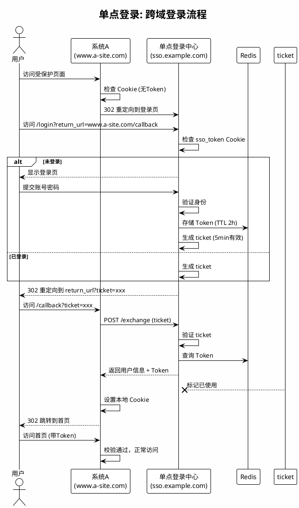

# 用户中心 - SSO 技术方案

## 1. 概述

本文档描述单点登录（SSO）的技术实现方案，包括系统架构、实现流程、Token 设计和 API 规范。

**相关需求文档**：
- [单点登录](单点登录.md)

**相关技术文档**：
- [用户中心 - 多设备会话管理](用户中心%20-%20多设备会话管理.md)（Session 结构、WebSocket 协议、跨端实现）
- [用户中心 - 数据库设计](../数据/用户中心%20-%20数据库设计.md)（Token/会话存储表结构、Redis 缓存设计）


## 2. 系统架构

```
┌─────────────────────────────────────────────────────────┐
│                     业务系统层                            │
│  ┌──────────┐  ┌──────────┐  ┌──────────┐              │
│  │  系统A    │  │  系统B    │  │  系统C    │              │
│  │a.example │  │b.example │  │c.example │              │
│  └────┬─────┘  └────┬─────┘  └────┬─────┘              │
└───────┼─────────────┼─────────────┼──────────────────────┘
        │             │             │
        ▼             ▼             ▼
┌─────────────────────────────────────────────────────────┐
│                    SSO 认证中心                           │
│  ┌──────────┐  ┌──────────┐  ┌──────────┐              │
│  │ 登录服务  │  │ Token服务 │  │ 通知服务  │              │
│  │ (多实例)  │  │ (多实例)  │  │ (Pub/Sub)│              │
│  └────┬─────┘  └────┬─────┘  └────┬─────┘              │
└───────┼─────────────┼─────────────┼──────────────────────┘
        │             │             │
        ▼             ▼             ▼
┌─────────────────────────────────────────────────────────┐
│                     存储层                               │
│  ┌──────────┐  ┌──────────┐  ┌──────────┐              │
│  │  MySQL   │  │  Redis   │  │  消息队列 │              │
│  │ (持久化)  │  │ (Token)  │  │ (通知)   │              │
│  └──────────┘  └──────────┘  └──────────┘              │
└─────────────────────────────────────────────────────────┘
```


## 3. 实现流程

### 3.1 统一登录中心

**登录页 URL 格式**：
```
https://sso.example.com/login?app_id=system_a&return_url=https%3A%2F%2Fa.example.com%2Fdashboard
```

**登录流程**：
```
用户访问系统A受保护页面
         ↓
系统A检查未登录
         ↓
重定向到 SSO 登录页 (携带 return_url 和 app_id)
         ↓
用户输入账号密码
         ↓
SSO 服务验证身份
         ↓
生成 AuthToken，写入 Redis
         ↓
设置 Cookie (sso_token)
         ↓
跳转回系统A (携带临时 ticket)
         ↓
系统A用 ticket 换取 AuthToken
         ↓
系统A设置本地 Cookie
         ↓
用户成功访问系统A
```

**规则**：
1. 必须携带合法的 `app_id`，否则拒绝登录
2. `return_url` 必须在应用注册的白名单中
3. 已登录用户直接跳转回业务系统（跳过登录页）
4. 支持记住我功能（7天免登）


### 3.2 跨域登录

**场景 1：同主域共享**
```
sso.example.com (SSO站点)
  ├── a.example.com (系统A)
  ├── b.example.com (系统B)
  └── c.example.com (系统C)
```
- Cookie Domain 设置为 `.example.com`，所有子系统自动共享 `sso_token` Cookie

**场景 2：跨域回调模式**
```
sso.example.com (SSO站点)
  ├── www.a-site.com (系统A)
  └── www.b-site.com (系统B)  ← 不同域名
```

**跨域登录流程**：
```
用户访问 www.b-site.com（未登录）
         ↓
系统B重定向到 sso.example.com/login?return_url=www.b-site.com/callback
         ↓
SSO 验证已登录（读取 sso_token Cookie）
         ↓
生成一次性 ticket (5分钟有效)
         ↓
重定向回 www.b-site.com/callback?ticket=xxx
         ↓
系统B后台调用 SSO 验证 ticket
         ↓
SSO 返回用户信息 + AuthToken
         ↓
系统B设置本地 Cookie
         ↓
跳转用户到原始请求页面
```

**规则**：
1. Ticket 只能使用一次，使用后立即失效
2. Ticket 有效期 5 分钟，超期需重新登录
3. 业务系统必须在注册的白名单域名内
4. 跨域场景下业务系统自行管理本地 Cookie


### 3.3 登录状态校验

**校验流程**：
```
业务系统收到请求
         ↓
从 Cookie/Header 获取 token
         ↓
调用 SSO 校验接口 POST /verify
         ↓
SSO 查询 Redis 验证 Token 有效性
         ↓
返回校验结果 + 用户信息
         ↓
业务系统决定是否放行
```

**规则**：
1. Token 校验响应时间 < 50ms
2. 支持本地缓存（建议5分钟），减少对 SSO 的调用
3. Token 即将过期时（< 10分钟）返回 `will_expire` 标记
4. 支持批量校验（数组方式）


### 3.4 单点登出

**登出流程**：
```
用户在系统A点击登出
         ↓
系统A调用 SSO 登出接口 POST /logout
         ↓
SSO 将 Token 加入黑名单
         ↓
SSO 查询该用户所有 Token
         ↓
逐个通知关联系统（WebHook 或 Redis Pub/Sub）
         ↓
各系统清除本地 Session/Cookie
         ↓
SSO 清除 Redis 中的 Token
         ↓
用户被重定向到 SSO 登录页
```

**规则**：
1. Token 加入黑名单，立即失效
2. 通知所有已登录的业务系统
3. 支持仅退出当前系统（参数控制）
4. 登出后清除浏览器 Cookie


## 4. Token 设计

### 2.1 AuthToken 数据结构

```typescript
interface AuthToken {
  token: string;           // UUID/GUID，32位字符串
  user_id: string;         // 用户ID
  app_id: string;          // 登录来源应用
  device_id: string;       // 设备标识
  created_at: number;      // 创建时间戳
  expires_at: number;      // 过期时间戳（默认2小时）
  refresh_token: string;   // 刷新令牌（默认7天）
}
```

### 2.2 Redis 存储设计

Token 存储使用 Redis，Key 格式和 TTL 如下（完整 Redis 缓存设计见[数据库设计文档](../数据/用户中心%20-%20数据库设计.md#4-redis-缓存设计)）：

| 数据 | Key 格式 | TTL |
|------|----------|-----|
| Token 信息 | `sso:token:{token}` | 2小时 |
| 用户 Token 列表 | `sso:user:{user_id}:tokens` | - |
| RefreshToken | `sso:refresh:{refresh_token}` | 7天 |
| 临时 Ticket | `sso:ticket:{ticket}` | 5分钟 |

**设计规则**：
- Token 使用 UUID v4 生成，确保全局唯一
- 同一用户多系统登录生成不同 Token
- Ticket 一次性使用，使用后立即失效
- RefreshToken 刷新后生成新的，旧 RefreshToken 立即失效


## 5. API 规范

详见 [用户中心 - SSO API协议](../协议/用户中心%20-%20SSO%20API协议.md)。


## 6. 单点登出通知机制

### 4.1 通知数据结构

```typescript
// Redis Pub/Sub 消息
interface LogoutNotification {
  type: 'USER_LOGOUT';
  user_id: string;
  logout_token: string;
  logout_at: number;
  logout_from: string;  // 登出来源应用
}
```

### 4.2 通知流程

各端订阅 Redis Pub/Sub 频道，收到 `USER_LOGOUT` 消息后清除本地 Token 并跳转登录页。


## 7. 多设备会话管理 & 跨端实现

详见 [用户中心 - 多设备会话管理](用户中心%20-%20多设备会话管理.md)。


## 8. 登录流程图




## 9. 安全清单

- [ ] Token 加密存储（不存明文）
- [ ] 请求增加签名验证（防重放攻击）
- [ ] 支持 SSL Pinning（防中间人）
- [ ] 检测到 Root/越狱后限制功能
- [ ] 支持远程 Token 吊销
- [ ] 敏感操作需二次验证


## 10. 变更记录

| 日期 | 版本 | 变更内容 |
|------|------|----------|
| 2026-03-23 | v1.3 | 多设备会话管理与跨端实现拆分至独立文档 |
| 2026-03-23 | v1.2 | API 规范拆分至独立协议文档 |
| 2026-03-23 | v1.1 | 新增系统架构图和实现流程详细设计（从项目文档迁移） |
| 2026-03-23 | v1.0 | 从项目文档提取技术实现内容，创建本文档 |
